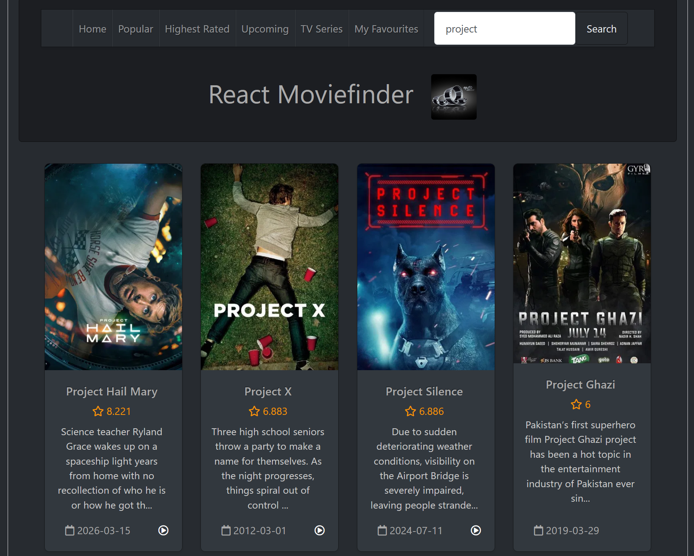

# MovieDB Project

A movie discovery website for my Web Programming course using React, TypeScript, and [The Movie Database API](https://developer.themoviedb.org/reference/getting-started). You can view popular movies and TV shows and search based on title, director, or genre. You can also see the trailers for movies and TV shows where trailers are available by clicking on the "play" button on a card.



## Local setup

Request your own API key from The Movie Database by [creating an account](https://www.themoviedb.org/signup) and filling out the form [here](https://www.themoviedb.org/settings/api).


### Clone project

```bash
git clone https://github.com/Infinity-MaxX/MovieDB-Project.git
cd MovieDB-Project
```

### Install dependencies

```bash
npm install
```

### Store local API key

Bash

```bash
echo "VITE_TMDB_API_KEY=<your_api_key>" > .env
```

PowerShell

```PowerShell
Write-Output "VITE_TMDB_API_KEY=<your_api_key>" | Out-File .env
```

### Run development build

```
npm run dev
```
